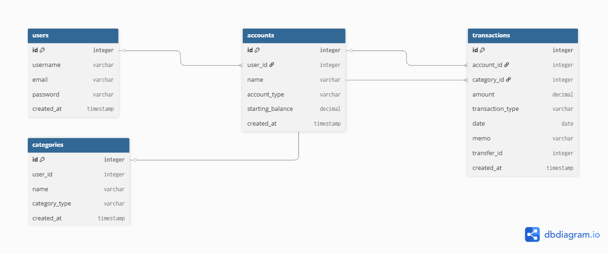

# Money-Tracker
Finance Application
# Personal Finance Manager

A full-stack personal finance application inspired by Microsoft Money and Quicken.

The goal of this project is to help users track spending, manage budgets, monitor recurring expenses, and visualize financial trends.

## Roadmap
### v1.0
- User authentication
- Account management
- Transaction tracking
- Budget categories
- Dashboard

### Future
- CSV import/export
- Recurring transactions
- Monthly spending reports
- Multi-user support

## Tech Stack

Frontend:
- Django templates
- HTML/CSS
- JavaScript

Backend:
- Python
- Django

Database:
- PostgreSQL

Testing:
- Pytest
- django.test.TestCase

Deployment:
- Render

Version Control:
- Git + GitHub

## Database Schema
```dbml
Table users {
  id integer [primary key]
  username varchar
  email varchar
  password varchar
  created_at timestamp
}

Table accounts {
  id integer [primary key]
  user_id integer [ref: > users.id]
  name varchar
  account_type varchar [note: 'checking, savings, credit']
  starting_balance decimal
  created_at timestamp
}

Table categories {
  id integer [primary key]
  user_id integer [null, note: 'null = default category']
  name varchar
  category_type varchar [note: 'income or expense']
  created_at timestamp
}

Table transactions {
  id integer [primary key]
  account_id integer [ref: > accounts.id]
  category_id integer [ref: > categories.id]
  amount decimal
  transaction_type varchar [note: 'income, expense, transfer']
  date date
  memo varchar
  transfer_id integer [null, note: 'links two transfer transactions']
  created_at timestamp
}
```
## Database Schema



## Setup & Installation
*Instructions will be added as the project develops.*

## Folder Structure
Money-Tracker/
├── venv/
├── money_tracker/
│   ├── __init__.py
│   ├── settings.py
│   ├── urls.py
│   ├── wsgi.py
│   └── asgi.py
├── core/
│   ├── migrations/
│   │   └── __init__.py
│   ├── __init__.py
│   ├── admin.py
│   ├── apps.py
│   ├── models.py
│   ├── tests.py
│   └── views.py
│   └── templates/
│   └── static/
│   └── tests/
│   │   └──__init__.py
│   │   └──test_models.py
│   │   └──test_view.py
│   │   └──test_forms.py
├── docs/
│   └── erd.png
│   └── architecture.md
│   └── install_instructions.md
│   └── lessons_learned.md
│   └── problems_encountered.md
├── .env
├── .gitignore
├── manage.py
└── requirements.txt

## Project Goals
- Practice full-stack application development
- Improve software architecture skills
- Strengthen database design knowledge
- Build a portfolio-ready project

## Status

Setup.
